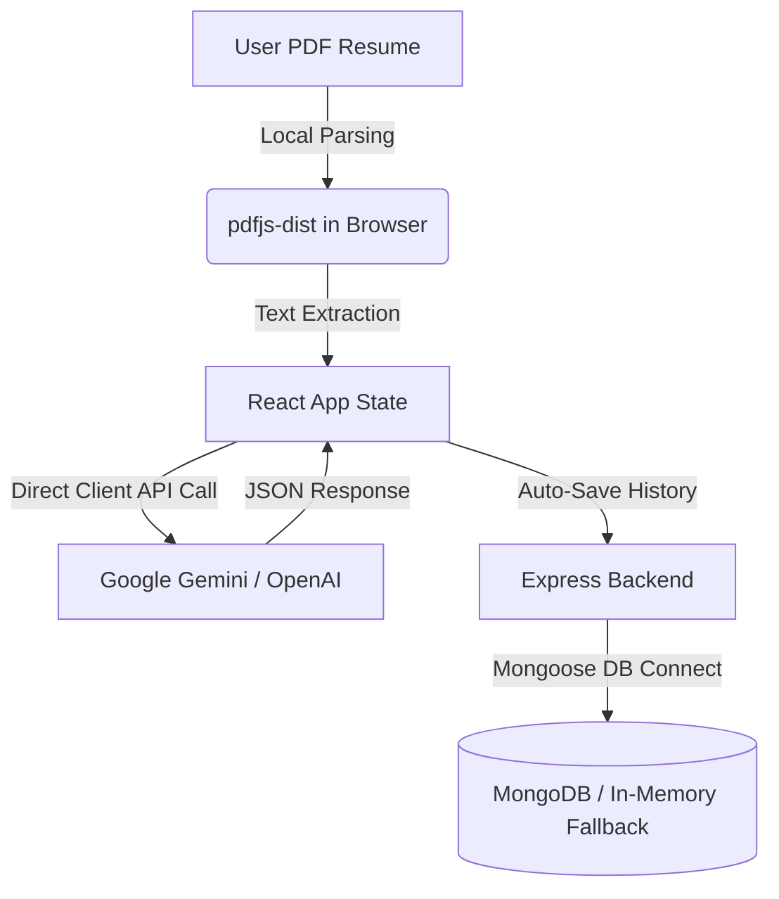

# Resume ATS Auditor 🚀

A privacy-focused, full-stack **Resume ATS Auditor and AI-Language Detector**. This tool helps candidates identify AI-written clichés, seniority inflation, and key missing terms in their resumes, providing real-time ATS optimization and line-by-line bullet rewrites.

---

## ✨ Key Features

- **🔒 Privacy-First / Local-First**: PDF parsing is executed 100% locally in the browser. Your resume files are never uploaded to any remote servers.
- **🔑 BYOK (Bring Your Own Key)**: Direct client-side HTTPS communication with AI models (Gemini & OpenAI) to bypass expensive paywalls. Your API keys are kept safely in your browser session storage.
- **📊 ATS Scoring (Before/After)**: Real-time ATS match rating with feedback on how much your score improves after implementing recommended changes.
- **🕵️ Recruiter Verdict & HR Perspective**: Actionable insights from a recruiter's perspective, warning you about red flags like unrealistic experience claims or emotional flatness.
- **📑 Bounding-Box PDF Highlights**: Interactive PDF renderer highlighting specific lines flagged for AI patterns, keyword stuffing, or inflation.
- **💾 Auto-Save History**: Stores audit history dynamically in a MongoDB database (Express backend), with a seamless **In-Memory fallback** if MongoDB is offline.
- **📥 PDF Export**: Export full optimization reports locally with high-fidelity PDF layouts.

---

## 🛠️ Tech Stack

### Frontend
- **React + Vite** (Fast HMR & build performance)
- **Tailwind CSS** (Premium modern layout and styles)
- **pdfjs-dist** (Client-side PDF text extraction and canvas rendering)
- **lucide-react** (Sleek modern icon system)
- **jspdf** (Local audit report export)

### Backend
- **Node.js + Express** (History store endpoints & health check)
- **Mongoose + MongoDB** (Database history persistence)

---

## 🚀 Getting Started

### 1. Prerequisites
- **Node.js** (v18+)
- **MongoDB** (Optional, falls back to in-memory if MongoDB is not running)

---

### 2. Setup & Configuration

#### Backend Setup
1. Navigate to the backend directory:
   ```bash
   cd backend
   ```
2. Install dependencies:
   ```bash
   npm install
   ```
3. Edit/Configure the `.env` file (`backend/.env`):
   ```env
   PORT=5000
   MONGODB_URI=mongodb://127.0.0.1:27017/ats_analyzer
   GEMINI_API_KEY=your_gemini_api_key
   OPENAI_API_KEY=your_openai_api_key
   ```
4. Start the server:
   ```bash
   npm run dev
   ```

#### Frontend Setup
1. Navigate to the frontend directory:
   ```bash
   cd ../frontend
   ```
2. Install dependencies:
   ```bash
   npm install
   ```
3. Edit/Configure the `.env` file (`frontend/.env`):
   ```env
   VITE_DEFAULT_PROVIDER=gemini
   VITE_DEFAULT_GEMINI_API_KEY=your_gemini_api_key
   VITE_DEFAULT_OPENAI_API_KEY=your_openai_api_key
   ```
4. Start the development server:
   ```bash
   npm run dev
   ```

---

## 🖥️ Running the Application

* **Frontend Dev Server**: Run `npm run dev` in `frontend/` (default URL: [http://localhost:5173](http://localhost:5173))
* **Backend Dev Server**: Run `npm run dev` in `backend/` (default URL: [http://localhost:5000](http://localhost:5000))
  


report link 
[Uploading Umang-Pandey-Data-Analyst_ATS_Audit_Report (1).pdf…]()


## 🛡️ Security & Privacy Architecture



1. **Client-Side Parsing**: Plaintext is parsed inside your browser tab. The PDF binary never leaves your machine.
2. **Direct AI Integration**: Requests are securely dispatched directly from your browser to AI Provider endpoints. No intermediary servers log your API keys or inputs.
3. **Session-Level Encryption**: Keys are saved to the browser's `sessionStorage` and are cleared when the tab is closed.
